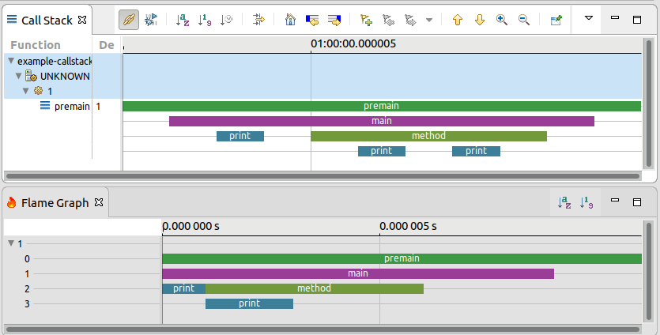

Call Stack Analysis on Custom Text Formats
==========================================

This plug-in is a proof of concept on adding call stack analysis
reusing existing analysis code.

To try it out
-------------

1. Add this plug-in to trace compass (I am using [current master](http://git.eclipse.org/c/tracecompass/org.eclipse.tracecompass.git/), specifically commit [338a0f6](http://git.eclipse.org/c/tracecompass/org.eclipse.tracecompass.git/log/?id=338a0f6c1405d5147122e220c389e60cc639314d))
 
2. Open the included [example-callstack-trace.txt](example-callstack-trace.txt) as a trace.

3. Import the custom [callstack.xml](callstack.xml) parser.

4. Open the call stack views:

